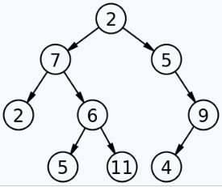

### 이진트리

1. **_이진트리의 용어 정리_**  
    * **루트(root)** : 부모를 갖지 않는 노드
    * **진입 차수** : 트리에 들어오는 어떤 노드에 들어오는 선의 갯수
    * **내부 노드** : 루트도 리프도 아닌 노드들
    * **포화 이진 트리** : 각 레벨이 허용하는 최대 노드 갯수 (2^k -1)
    * **완전 이진 트리** : 높이가 k인 이진트리가 레벨 0 부터 k-2 까지 모두 존재하고 k-1 레벨에서 왼쪽부터 오른쪽으로 노드가 차례대로 채워진 트리  
2. **_높이 우선 순회와 너비 우선순회_**  
    * **너비우선순회(BFS)** : 루트 노드에서 형제 노드를 방문하는 순회 방법 
    * **높이 우선 순회(DFS)** : 왼쪽이나 오른쪽을 선택하여 형제 노드 이전에 수직으로 순회하는 방법 
        1. **전위 순회** : Root -> Left -> Right 순으로 순회하는 방법. 
            + DB에 저장하고 트리 구조를 알아야할 때 적합하다.
            + **why?** 시작점이 **Root 노드**를 가리키며 자식노드로 나아간다. 
        2. **중위 순회** : Left -> Root -> Right 순으로 순회하는 방법
            + 이 방법은 순회의 데이터를 [1, 3 , 5 ,7 ...] 와 같이 순서대로 저장이 가능하여 일반적으로 가장 많이 사용한다.
        3. **후위 순회** : Left -> Right -> root 순으로 순회하는 방법.  

3. **_DFS와 BFS 어떻게 선택할까?_**
    * **너비가 넓은 경우** : 완전 이진트리 및 포화 이진트리에 가까울 수록 **BFS**를 사용하는 것이 좋다.  
    * **높이가 깊은 경우** : 이진 트리에 가깝지 않고 노드에 갯수와 비교해 지나치게 높이가 높다면 **DFS**를 사용하는 것이 좋다.

**출처** 
    1. https://www.geeksforgeeks.org/complete-binary-tree/

