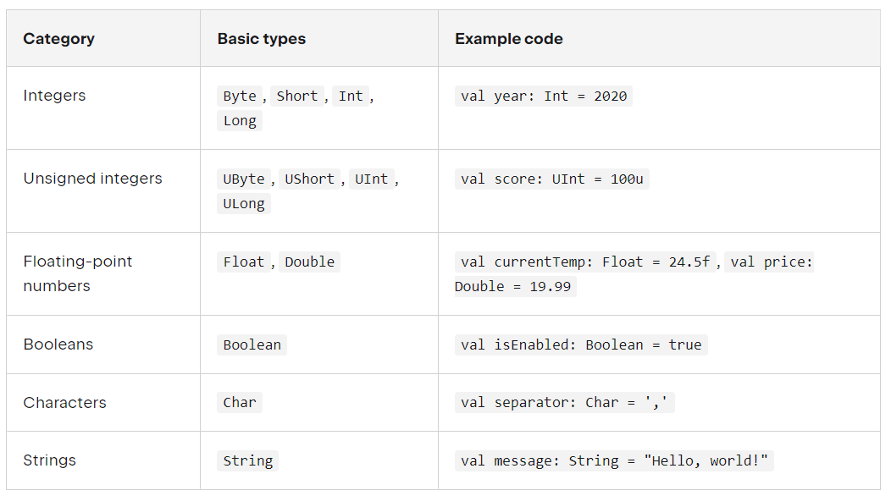

# 코틀린 튜토리얼 정리

# 1. 코틀린은 함수 기반 언어

```kotlin
fun main() {
    println("Hello, world!")
    // Hello, world!
}
```

# 2. 코틀린에서 val

* 자바스크립트와 같은 동적 타입 변수
* 사칙 연산 방법은 타 프로그래밍 언어와 같다.

```kotlin

    var customer = 8
    customer += 5 // 13
    customer -= 5 // 8
    customer *= 2 // 16
    customer /= 8 // 2
```

# 3코틀린의 타입

## 3.1 여러가지 타입



## 3.2 타입 선언 방법

```kotlin
    val integerNum: Int
    integerNum = 4

    val e: String = "hello"

```

## 불변 변수 val 과 가변 변수 var

```kotlin
    fun main() {
    // 선언할 때 주입하면 
    val integerNum: Int = 4

    //integerNum = 5 // 에러
    val integerNum2: Int
    integerNum2 = 5
    
    println(integerNum)
    println(integerNum2)
    }

```
